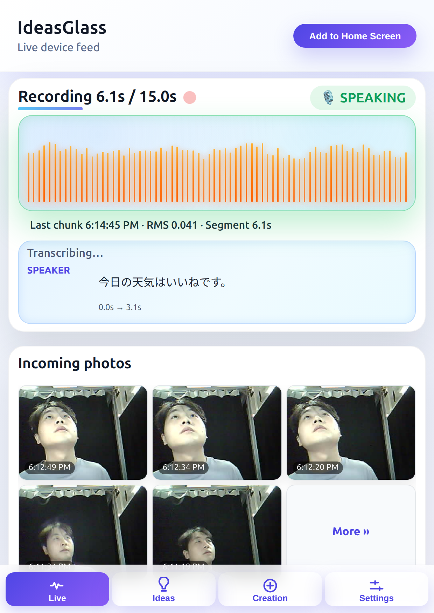

  <b>Languages:</b>
  <a href="README.md">English</a>
  · <a href="i18n/README.zh-Hans.md">简体中文</a>
  · <a href="i18n/README.zh-Hant.md">繁體中文</a>
  · <a href="i18n/README.ja.md">日本語</a>
  · <a href="i18n/README.ko.md">한국어</a>
  · <a href="i18n/README.vi.md">Tiếng Việt</a>
  · <a href="i18n/README.ar.md">العربية</a>
  · <a href="i18n/README.fr.md">Français</a>
  · <a href="i18n/README.es.md">Español</a>

# IdeasGlass

*A wearable AI glass that turns ideas into actions, income, and creative momentum.*

<table>
  <tr>
    <td align="center" style="padding:6px 10px;">
      <b>Ecosystem</b> 
      <a href="https://lazying.art">LazyingArt</a>
      · <a href="https://onlyideas.art">OnlyIdeas</a>
      · <a href="https://chat.lazying.art">EchoMind</a>
      · <a href="https://coin.lazying.art">LazyingArt Coin</a>
    </td>
    <td align="center" style="padding:6px 10px;">
      <b>Support IdeasGlass</b> 
      
    </td>
  </tr>
  </table>

  
  
   
  App UI (left) · Hardware (right)

Explore community experiments at <a href="https://onlyideas.art">onlyideas.art</a>.

## Why IdeasGlass

IdeasGlass is an AI-first wearable built for people who live in streams of ideas. It captures, translates, organizes, and executes on creativity the moment inspiration strikes, whether you are narrating a concept in motion or hosting a live session.

## Core Capabilities

- **Creation-native hardware** – lightweight glasses and wearable inputs, tuned for voice-first capture plus subtle gesture shortcuts.
- **Instant translation** – real-time language detection/translation so you can ideate across teams or audiences without switching tools.
- **EchoMind co-pilot** – tight pairing with `chat.lazying.art` for brainstorming, script drafting, and multilingual content coaching.
- **Channel autopilot** – drafts outlines, long-form scripts, short-form hooks, and schedules uploads to YouTube or other feeds.
- **Highlights & reels** – auto-selects moments, generates thumbnails, subtitles, and social-ready clips.
- **Income layer** – connects to LazyingArt Coin for tipping, credit payouts, and conversion to on-chain assets.
- **Spending & focus** – tracks operational spend, surfaces profitable formats, and distills your personal strengths into next projects.

## Sample Workflow

1. **Capture** – Speak or sketch a concept; IdeasGlass transcribes, translates, and tags the intent.
2. **Co-create** – EchoMind refines the idea, drafts scripts, and suggests CTAs tailored for each platform.
3. **Publish** – The channel agent auto-produces highlight videos, gallery images, and uploads them with metadata.
4. **Monetize** – Credits route through LazyingArt Coin (`coin.lazying.art`) and payouts sync with your preferred wallets.
5. **Reflect** – Spending, reach, and engagement dashboards surface what to double down on next.

## Ecosystem Links

- `LazyingArt` — flagship studio, launches, and hardware drops.
- `OnlyIdeas` — research guild where community sparks become funded experiments.
- `EchoMind` — multilingual conversational layer that powers coaching and scripting.
- `LazyingArt Coin` — unified rewards + payout rail bridging credits and on-chain value.

## Support & Contact

- ご支援は IdeasGlass のハードウェア試作・運用を加速させ、多くのクリエイターへ還元されます。
- 你的支持将帮助我们推进硬件、AI 工作流与生态建设，向社区持续开放。
- Your support keeps the wearable, agent, and ecosystem roadmap moving.

<table style="margin:0 auto; text-align:center; border-collapse:collapse;">
  <tr>
    <td style="text-align:center; vertical-align:middle; padding:6px 12px;">
      <a href="https://chat.lazying.art/donate">https://chat.lazying.art/donate</a>
    </td>
    <td style="text-align:center; vertical-align:middle; padding:6px 12px;">
      
    </td>
  </tr>
  <tr>
    <td style="text-align:center; vertical-align:middle; padding:6px 12px;">
      
    </td>
    <td style="text-align:center; vertical-align:middle; padding:6px 12px;">
      
    </td>
  </tr>
  <tr>
    <td style="text-align:center; vertical-align:middle; padding:6px 12px;"><strong>WeChat</strong></td>
    <td style="text-align:center; vertical-align:middle; padding:6px 12px;"><strong>Alipay</strong></td>
  </tr>
  <tr>
    <td style="text-align:center; vertical-align:middle; padding:6px 12px;"></td>
    <td style="text-align:center; vertical-align:middle; padding:6px 12px;"></td>
  </tr>
</table>

- For partnerships, email **contact@lazying.art** with the subject `IdeasGlass`. 

IdeasGlass is where AI wearables stop listening and start building with you.

## Setup & Run

Prereqs
- Python 3.10+ and a modern pip
- Optional: PostgreSQL (for persistent photos/segments/transcripts)

Install dependencies
- `cd backend/bridge && python -m venv .venv && source .venv/bin/activate && pip install -r requirements.txt`

Configure environment (safe examples)
- If you use Postgres, set `DATABASE_URL` in your shell (or a local `.env` that you do NOT commit):
  - `export DATABASE_URL="postgresql://<db_user>@localhost/ideasglass_db"` (peer/local auth)
  - or `export DATABASE_URL="postgresql://<db_user>:<db_password>@localhost/ideasglass_db"` (with password)
  - Avoid putting real usernames/passwords into shared docs or commits.

Run the backend (two options)
- Direct with uvicorn:
  - ``
    IDEASGLASS_WHISPER_MODEL=base IDEASGLASS_WHISPER_DEVICE=cuda \
    uvicorn backend.bridge.app:app --host 0.0.0.0 --port 8765 --proxy-headers --forwarded-allow-ips="*" --reload
    ``
- Via helper with argparse:
  - ``
    python backend/bridge/serve.py --whisper-model base --whisper-device cuda --reload
    ``

Open the dashboard
- http://localhost:8765/ (installable PWA)
- http://localhost:8765/healthz

### Firmware (XIAO ESP32S3)

- Power UX: Hold the button ~0.8s at power‑up to boot. Hold ~2.5s while running to enter deep sleep. Short press still triggers a capture.
- Arduino IDE:
  - Board: ESP32 → XIAO_ESP32S3
  - PSRAM: OPI PSRAM (required for camera)
  - Partition Scheme: Default with spiffs (3MB APP/1.5MB SPIFFS) or Maximum APP (no FS)
  - Port: select `/dev/ttyACM0` (Linux) or the corresponding serial device
- Arduino CLI (included at `bin/arduino-cli`):
  - Compile: `bin/arduino-cli compile --fqbn esp32:esp32:XIAO_ESP32S3:PartitionScheme=default_8MB,PSRAM=opi IdeaGlass/firmware/ideasglass_arduino/IdeasGlassClient`
  - Upload: `bin/arduino-cli upload -p /dev/ttyACM0 --fqbn esp32:esp32:XIAO_ESP32S3:PartitionScheme=default_8MB,PSRAM=opi IdeaGlass/firmware/ideasglass_arduino/IdeasGlassClient`
  - If port busy: `fuser -k /dev/ttyACM0`; if permission denied: `sudo usermod -aG dialout $USER` and re‑login (or `sudo chmod a+rw /dev/ttyACM0`).

Choose a Whisper model
- Defaults to `base`. For higher quality, set `IDEASGLASS_WHISPER_MODEL` to `small`, `medium`, or `large-v3`/`large-v3-turbo` (GPU recommended for larger models).
- Device: `IDEASGLASS_WHISPER_DEVICE=cuda` for NVIDIA GPUs, or `cpu`.
- Mixed precision: `IDEASGLASS_WHISPER_FP16=1` (GPU) or `0` (CPU).

Prefetch models (optional)
- ``
  python backend/bridge/tools/prefetch_whisper_models.py --models tiny,base,small,medium,large-v3 --device cuda --fp16 1
  ``

Login & bind your device
- Register or login from Settings in the dashboard.
- Bind your device ID in the “Bind device” field. Only your bound devices will stream to your account.
- To generate a device ID + QR: `python backend/bridge/tools/generate_device_id.py --out logs/device-id.png`

## Developer Docs

- [IdeasGlass Object Analysis](OmiGlass/docs/ideasglass_analysis.mdx)
- [Arduino Hardware Blueprint](OmiGlass/docs/ideasglass_arduino_hardware.md)
- [Multi-platform App / PWA Plan](OmiGlass/docs/ideasglass_pwa_plan.md)
- [Bridge & Arduino HTTPS Client](docs/ideasglass_bridge.md)

Quick device binding
- Generate ID (in conda "glass"): `python backend/bridge/tools/generate_device_id.py`
- Set it in firmware: `IdeaGlass/firmware/ideasglass_arduino/IdeasGlassClient/IdeasGlassClient.ino` (`kDeviceId`)
- Run backend and open `http://localhost:8765`, register/login, then bind the device ID in the Account panel

## Acknowledgements

We stand on the shoulders of great open projects — thank you to:
- OmiGlass by BasedHardware: https://github.com/BasedHardware/omi/tree/main/omiGlass  
  - **Referral Program** — earn 20 % commissions: https://www.omi.me/?ref=LazyingArt  
    Coupon code `LazyingArt` gives your friends 10 % off (30 % commission unlocks after 10 sales).  
  - **Quick links**:  
    - Discord: https://discord.com/invite/8MP3b9ymvx?ref=LazyingArt  
    - Seeed XIAO BLE Sense kit: https://www.seeedstudio.com/Seeed-XIAO-BLE-Sense-nRF52840-p-5253.html
- OpenAI Whisper: https://github.com/openai/whisper
- WhisperX: https://github.com/m-bain/whisperX
- Ollama: https://github.com/ollama/ollama
