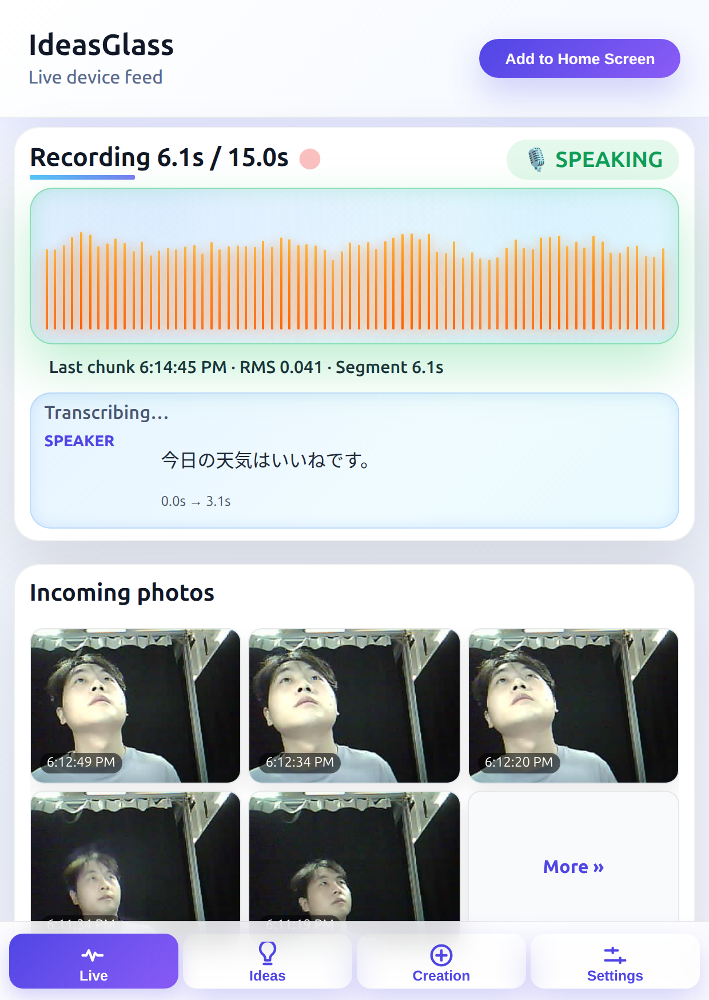

[English](README.md) · [العربية](i18n/README.ar.md) · [Español](i18n/README.es.md) · [Français](i18n/README.fr.md) · [日本語](i18n/README.ja.md) · [한국어](i18n/README.ko.md) · [Tiếng Việt](i18n/README.vi.md) · [中文 (简体)](i18n/README.zh-Hans.md) · [中文（繁體）](i18n/README.zh-Hant.md) · [Deutsch](i18n/README.de.md) · [Русский](i18n/README.ru.md)


[](https://github.com/lachlanchen/lachlanchen/blob/main/figs/banner.png)


# IdeasGlass

*A wearable AI glass that turns ideas into actions, income, and creative momentum.*

> Voice-first wearable AI pipeline: capture from ESP32 glasses, process in FastAPI, and monitor/control via a live PWA dashboard.


| Lane | Purpose |
|---|---|
| 🎙️ Wearable capture | ESP32 glasses send audio, photos, and telemetry in near-real-time |
| 🧠 Backend intelligence | FastAPI ingests streams, transcribes, segments, and persists metadata |
| 🖥️ Dashboard | PWA shows live waveform, transcripts, and device/account status |

<table>
  <tr>
    <td align="center" style="padding:6px 10px;">
      <b>Ecosystem</b><br/>
      <a href="https://lazying.art">LazyingArt</a>
      · <a href="https://onlyideas.art">OnlyIdeas</a>
      · <a href="https://chat.lazying.art">EchoMind</a>
      · <a href="https://coin.lazying.art">LazyingArt Coin</a>
    </td>
    <td align="center" style="padding:6px 10px;">
      <b>Support IdeasGlass</b><br/>
      <a href="https://chat.lazying.art/donate"></a>
    </td>
  </tr>
</table>

<div align="center">
  
  
  <br/>
  <sub>App UI (left) · Hardware (right)</sub>
</div>

Explore community experiments at <a href="https://onlyideas.art">onlyideas.art</a>.

## 🚀 Overview

IdeasGlass is an AI-first wearable system for voice-first idea capture and execution. In this repository, the primary runtime path is:

- `backend/glass/` for FastAPI APIs, WebSocket ingest, Whisper-based transcription, and the installable PWA dashboard.
- `IdeaGlass/firmware/ideasglass_arduino/IdeasGlassClient/` for XIAO ESP32S3 firmware streaming telemetry/audio/photos.

If you are new to this repo, start there first.

### At a glance

| Area | Primary location | What it does |
|---|---|---|
| Backend API + PWA | `backend/glass/` | FastAPI endpoints, WebSocket ingest/fanout, transcription, dashboard |
| Firmware | `IdeaGlass/firmware/ideasglass_arduino/IdeasGlassClient/` | ESP32 capture/streaming client |
| Bridge notes | `references/ideasglass_bridge.md` | TLS/WAN reliability notes and deployment field tips |
| README translations | `i18n/` | Multilingual docs synced from the canonical README |

## ✨ Why IdeasGlass

IdeasGlass is an AI-first wearable built for people who live in streams of ideas. It captures, translates, organizes, and executes on creativity the moment inspiration strikes, whether you are narrating a concept in motion or hosting a live session.

## 🧩 Features

### Product vision features

- **Creation-native hardware** – lightweight glasses and wearable inputs, tuned for voice-first capture plus subtle gesture shortcuts.
- **Instant translation** – real-time language detection/translation so you can ideate across teams or audiences without switching tools.
- **EchoMind co-pilot** – tight pairing with `chat.lazying.art` for brainstorming, script drafting, and multilingual content coaching.
- **Channel autopilot** – drafts outlines, long-form scripts, short-form hooks, and schedules uploads to YouTube or other feeds.
- **Highlights & reels** – auto-selects moments, generates thumbnails, subtitles, and social-ready clips.
- **Income layer** – connects to LazyingArt Coin for tipping, credit payouts, and conversion to on-chain assets.
- **Spending & focus** – tracks operational spend, surfaces profitable formats, and distills your personal strengths into next projects.

### Repository/runtime features

- FastAPI backend with REST + WebSocket endpoints for ingest (`/api/v1/audio`, `/ws/audio-ingest`) and live stream fanout (`/ws/stream`).
- Deterministic audio segmentation (default ~15 s with overlap) into `backend/glass/audio_segments/`.
- Optional openai-whisper streaming transcripts with configurable latency thresholds.
- Optional Postgres persistence (`DATABASE_URL`) for messages, photos, chunks, segments, transcripts.
- PWA dashboard with live waveform, transcript updates, and install support on desktop/mobile.
- Arduino firmware support for XIAO ESP32S3 Sense camera + mic flows.

## 🔄 Sample Workflow

1. **Capture** – Speak or sketch a concept; IdeasGlass transcribes, translates, and tags the intent.
2. **Co-create** – EchoMind refines the idea, drafts scripts, and suggests CTAs tailored for each platform.
3. **Publish** – The channel agent auto-produces highlight videos, gallery images, and uploads them with metadata.
4. **Monetize** – Credits route through LazyingArt Coin (`coin.lazying.art`) and payouts sync with your preferred wallets.
5. **Reflect** – Spending, reach, and engagement dashboards surface what to double down on next.

## 🗂️ Project Structure

```text
IdeasGlass/
├── README.md
├── i18n/                                  # README translations
├── backend/
│   ├── glass/                             # Primary FastAPI + PWA backend
│   │   ├── app.py
│   │   ├── serve.py
│   │   ├── requirements.txt
│   │   ├── static/
│   │   ├── tools/
│   │   └── audio_segments/
│   ├── tornado_app/                       # Secondary/parallel ingest backend path
│   ├── memo/
│   ├── memo_legacy/
│   └── ngrok_bridge/
├── IdeaGlass/firmware/ideasglass_arduino/
│   ├── IdeasGlassClient/IdeasGlassClient.ino
│   ├── config.h
│   ├── WifiTest/WifiTest.ino
│   ├── wifi_credentials.example.h
│   └── README.md
├── references/ideasglass_bridge.md        # Bridge + deployment notes
├── docs/                                  # Additional site/docs assets
├── development_plan/
├── app/
├── ops/observability/
├── figs/
└── seeed_studio_xiao_esp32s3_dev/
```

## 🧰 Prerequisites

- Python 3.10+
- `pip` (or conda environment with compatible Python)
- Optional: NVIDIA GPU + CUDA/cuDNN for faster Whisper inference
- Optional: PostgreSQL for persistence
- For firmware: Arduino IDE or `arduino-cli`, Seeed XIAO ESP32S3 Sense, PSRAM enabled

| Component | Requirement | Notes |
|---|---|---|
| Backend runtime | Python 3.10+, `pip` | Use venv or conda (`glass`) |
| GPU acceleration (optional) | NVIDIA + CUDA/cuDNN | Improves Whisper latency |
| Persistence (optional) | PostgreSQL | Enabled via `DATABASE_URL` |
| Firmware toolchain | Arduino IDE / `arduino-cli` | Use XIAO ESP32S3 profile with PSRAM |

## ⚙️ Installation

### Backend dependencies

```bash
cd backend/glass
python -m venv .venv
source .venv/bin/activate
pip install -r requirements.txt
```

### Firmware prerequisites

- Copy `IdeaGlass/firmware/ideasglass_arduino/wifi_credentials.example.h` to `wifi_credentials.h` (recommended) and set SSID/password.
- In Arduino IDE, use board `ESP32 -> XIAO_ESP32S3` with `PSRAM: OPI PSRAM`.
- Partition scheme: `Default with spiffs (3MB APP/1.5MB SPIFFS)` or `Maximum APP` when filesystem is not needed.

## ▶️ Usage

### Run backend (uvicorn)

```bash
IDEASGLASS_WHISPER_MODEL=base IDEASGLASS_WHISPER_DEVICE=cuda \
uvicorn backend.glass.app:app \
  --host 0.0.0.0 \
  --port 8765 \
  --proxy-headers \
  --forwarded-allow-ips="*" \
  --reload
```

### Run backend (helper)

```bash
python backend/glass/serve.py --whisper-model base --whisper-device cuda --reload
```

### Open dashboard

- `http://localhost:8765/`
- `http://localhost:8765/healthz`

| Endpoint | Purpose |
|---|---|
| `/` | Main dashboard (PWA-capable UI) |
| `/healthz` | Backend liveness check |
| `/ws/audio-ingest` | Device ingest WebSocket |
| `/ws/stream` | Live stream fanout to dashboard clients |

### Login and bind your device

1. Register or login from the dashboard Settings/Account area.
2. Bind your device ID in the `Bind device` field.
3. Only bound devices will stream to your account.

Generate a device ID + QR image:

```bash
python backend/glass/tools/generate_device_id.py --out logs/device-id.png
```

Bind through API (cookie session required):

```bash
curl -X POST http://localhost:8765/api/v1/devices/bind \
  -H 'Content-Type: application/json' \
  -d '{"device_id":"<your-device-id>"}' \
  -b cookies.txt -c cookies.txt
```

Verify current account and bound devices:

```bash
curl -s http://localhost:8765/api/v1/auth/me -b cookies.txt -c cookies.txt | jq
```

Optional migration (rename historical data to a new device ID):

```bash
curl -X POST http://localhost:8765/api/v1/devices/rename \
  -H 'Content-Type: application/json' \
  -d '{"from_id":"old-id","to_id":"<your-device-id>"}' \
  -b cookies.txt -c cookies.txt
```

### Firmware build/upload (Arduino CLI)

```bash
FQBN='esp32:esp32:XIAO_ESP32S3:PartitionScheme=default_8MB,PSRAM=opi'
SKETCH='IdeaGlass/firmware/ideasglass_arduino/IdeasGlassClient'
PORT='/dev/ttyACM0'

bin/arduino-cli compile --fqbn "$FQBN" "$SKETCH"
bin/arduino-cli upload -p "$PORT" --fqbn "$FQBN" "$SKETCH"
```

If port is busy: `fuser -k /dev/ttyACM0`.
If permission denied: `sudo usermod -aG dialout $USER` then re-login (or temporary `sudo chmod a+rw /dev/ttyACM0`).

### Firmware power UX (XIAO ESP32S3)

- Hold the button ~0.8 s at power-up to boot.
- Hold ~2.5 s while running to enter deep sleep.
- Short press while running still triggers capture.

## 🛠️ Configuration

### Core environment variables

- `DATABASE_URL`: optional Postgres DSN for persistent storage.
- `IDEASGLASS_WHISPER_MODEL`: `base` (default), `small`, `medium`, `large-v3`, `large-v3-turbo`.
- `IDEASGLASS_WHISPER_DEVICE`: `cuda` or `cpu`.
- `IDEASGLASS_WHISPER_FP16`: `1` for GPU mixed precision, `0` for CPU.
- `IDEASGLASS_TRANSCRIBE`: `1` (default) to enable transcription, `0` to disable.
- `IDEASGLASS_TRANSCRIPT_INTERVAL_MS`: rolling transcript interval.
- `IDEASGLASS_TRANSCRIPT_THRESHOLDS_MS`: comma-separated thresholds (default `3000,6000,15000`).

| Variable | Default / options | Effect |
|---|---|---|
| `DATABASE_URL` | unset by default | Enables Postgres persistence for account/device data |
| `IDEASGLASS_WHISPER_MODEL` | `base` (`small`, `medium`, `large-v3`, `large-v3-turbo`) | Controls accuracy vs latency |
| `IDEASGLASS_WHISPER_DEVICE` | `cuda` or `cpu` | Inference backend |
| `IDEASGLASS_WHISPER_FP16` | `1` GPU, `0` CPU-safe | Mixed precision control |
| `IDEASGLASS_TRANSCRIBE` | `1` | Toggle transcription pipeline |
| `IDEASGLASS_TRANSCRIPT_INTERVAL_MS` | runtime configured | Rolling transcript push interval |
| `IDEASGLASS_TRANSCRIPT_THRESHOLDS_MS` | `3000,6000,15000` | Progressive transcript emission thresholds |

Safe `DATABASE_URL` examples:

- `export DATABASE_URL="postgresql://<db_user>@localhost/ideasglass_db"` (peer/local auth)
- `export DATABASE_URL="postgresql://<db_user>:<db_password>@localhost/ideasglass_db"` (password auth)

### Audio gain and segmentation knobs

- `IDEASGLASS_GAIN_TARGET` (default `0.032`)
- `IDEASGLASS_GAIN_MAX` (default `1.8`)
- `IDEASGLASS_GAIN_MIN_RMS` (default `0.008`)
- `IDEASGLASS_SPEECH_RMS` (default `0.03`)
- `IDEASGLASS_SPEECH_MARGIN` (default `0.005`)
- `IDEASGLASS_SEGMENT_TARGET_MS` (default `15000`)
- `IDEASGLASS_SEGMENT_OVERLAP_MS` (default `2000`)
- `IDEASGLASS_SEGMENT_GAIN_TARGET` (defaults to chunk gain target)

| Audio knob | Default | Purpose |
|---|---|---|
| `IDEASGLASS_GAIN_TARGET` | `0.032` | Target RMS normalization |
| `IDEASGLASS_GAIN_MAX` | `1.8` | Upper clamp for gain amplification |
| `IDEASGLASS_GAIN_MIN_RMS` | `0.008` | Floor to avoid amplifying near-silence |
| `IDEASGLASS_SPEECH_RMS` | `0.03` | Speech activity RMS baseline |
| `IDEASGLASS_SPEECH_MARGIN` | `0.005` | Margin around speech threshold |
| `IDEASGLASS_SEGMENT_TARGET_MS` | `15000` | Segment length target |
| `IDEASGLASS_SEGMENT_OVERLAP_MS` | `2000` | Segment overlap for continuity |
| `IDEASGLASS_SEGMENT_GAIN_TARGET` | inherits chunk gain | Segment-level normalization target |

### Model prefetch (optional)

```bash
python backend/glass/tools/prefetch_whisper_models.py \
  --models tiny,base,small,medium,large-v3 \
  --device cuda \
  --fp16 1
```

## 🧪 Examples

### Generate and bind a device ID

```bash
python backend/glass/tools/generate_device_id.py --out logs/device-id.png
```

Then set `kDeviceId` in:

- `IdeaGlass/firmware/ideasglass_arduino/IdeasGlassClient/IdeasGlassClient.ino`

Dashboard flow:

1. Register/login in Settings.
2. Bind the device in the Account panel.
3. Only bound devices stream to your account.

### REST ingest examples

```bash
curl -X POST http://localhost:8765/api/v1/messages \
  -H 'Content-Type: application/json' \
  -d '{"device_id":"dev-001","message":"hello from curl"}'
```

```bash
curl -X POST http://localhost:8765/api/v1/messages \
  -H 'Content-Type: application/json' \
  -d '{
    "device_id":"dev-001",
    "message":"photo demo",
    "photo_base64":"'"$(base64 -w0 sample.jpg)"'",
    "photo_mime":"image/jpeg"
  }'
```

```bash
rec --bits 16 --channels 1 --rate 16000 -c 1 -b 16 -e signed-integer temp.raw trim 0 0.25
curl -X POST http://localhost:8765/api/v1/audio \
  -H 'Content-Type: application/json' \
  -d '{
    "device_id":"dev-001",
    "sample_rate":16000,
    "bits_per_sample":16,
    "duration_ms":250,
    "rms":0.05,
    "audio_base64":"'"$(base64 -w0 temp.raw)"'"
  }'
```

```bash
curl http://localhost:8765/api/v1/audio/segments | jq '.[0]'
curl -o latest.wav http://localhost:8765/api/v1/audio/segments/<segment-id>
```

## 🧭 Development Notes

### Focus area

This repo contains multiple backend tracks. Current contributor guidance and runtime focus is `backend/glass/` unless otherwise requested.

### Static/syntax check

```bash
python -m compileall backend/glass/app.py
```

### Developer docs

- [IdeasGlass Object Analysis](OmiGlass/docs/ideasglass_analysis.mdx)
- [Arduino Hardware Blueprint](OmiGlass/docs/ideasglass_arduino_hardware.md)
- [Multi-platform App / PWA Plan](OmiGlass/docs/ideasglass_pwa_plan.md)
- [Bridge & Arduino HTTPS Client](docs/ideasglass_bridge.md)

> Note: In the current repository snapshot, some historical links above appear to have moved (for example, bridge notes now exist at `references/ideasglass_bridge.md`). The original links are preserved as canonical README content.

### Quick device binding (preserved workflow)

- Generate ID (in conda `glass`): `python backend/glass/tools/generate_device_id.py`
- Set it in firmware: `IdeaGlass/firmware/ideasglass_arduino/IdeasGlassClient/IdeasGlassClient.ino` (`kDeviceId`)
- Run backend and open `http://localhost:8765`, register/login, then bind the device ID in the Account panel

## 🆘 Troubleshooting

- **Port already in use:** run backend on another port and update client settings.
- **Serial port busy:** `fuser -k /dev/ttyACM0`.
- **Linux serial permission denied:** `sudo usermod -aG dialout $USER` and re-login.
- **Postgres unavailable:** backend can run without DB for partial functionality; verify `DATABASE_URL` and restart.
- **Whisper performance issues:** use smaller models (`base`/`small`) or disable transcription via `IDEASGLASS_TRANSCRIBE=0`.
- **TLS/time sync instability on ESP32:** verify Wi-Fi, NTP availability (UDP/123), and cert/host settings; see `references/ideasglass_bridge.md` for detailed field notes.
- **No live waveform updates:** check backend logs and browser console for `[IdeasGlass][wave]` traces and confirm `/ws/stream` connectivity.

## 🌐 Ecosystem Links

🧠 **EchoMind** — Multilingual AI companion for learning and creation.  
[chat.lazying.art](https://chat.lazying.art)

🌱 **OnlyIdeas** — Research-to-product community for bold concepts.  
[onlyideas.art](https://onlyideas.art)

💸 **LazyEarn** — Automations to turn small wins into income.  
[earn.lazying.art](https://earn.lazying.art)

📚 **LazyLearn** — Physics & chemistry tracks and notebooks.  
[learn.lazying.art](https://learn.lazying.art)

🤖 **IdeasRobot** — Agent that turns ideas into drafts, tasks, and posts.  
[robot.lazying.art](https://robot.lazying.art)

👓 **IdeasGlass** — Capture, translate, and auto-produce highlight reels.  
[glass.lazying.art](https://glass.lazying.art)

🪙 **LazyingArt Coin** — Rewards and payouts bridging contributions and on-chain value.  
[coin.lazying.art](https://coin.lazying.art)

🧪 **IDEAS** — Notebook of research notes and essays.  
[ideas.onlyideas.art](https://ideas.onlyideas.art)

🎨 **LazyingArt** — Studio behind OnlyIdeas, EchoMind, LazyEdit, and IdeasGlass.  
[lazying.art](https://lazying.art)

## 🙏 Acknowledgements

We stand on the shoulders of great open projects — thank you to:

- <a href="https://www.omi.me/?ref=LazyingArt" target="_blank" rel="noopener" style="display:inline-flex;align-items:center;justify-content:center;padding:0.45rem 1rem;border-radius:999px;background:#111827;color:#ffffff;font-weight:700;text-decoration:none;">Get OmiGlass (BasedHardware)</a>
  - **Referral Program** — Use coupon `LazyingArt` to save 10% (30% commission unlocks after 10 sales).

    <div style="display:flex;flex-wrap:wrap;gap:0.4rem;margin:0.3rem 0;">
      <a href="https://www.omi.me/?ref=LazyingArt" target="_blank" rel="noopener" style="display:inline-flex;align-items:center;justify-content:center;padding:0.45rem 1.1rem;border-radius:999px;background:#111827;color:#ffffff;font-weight:700;text-decoration:none;">Get OmiGlass with LazyingArt</a>
      <a href="https://discord.com/invite/8MP3b9ymvx?ref=LazyingArt" target="_blank" rel="noopener" style="display:inline-flex;align-items:center;justify-content:center;padding:0.45rem 1rem;border-radius:999px;background:#2563eb;color:#ffffff;font-weight:700;text-decoration:none;">Join Omi Discord</a>
      <a href="https://www.seeedstudio.com/Seeed-XIAO-BLE-Sense-nRF52840-p-5253.html" target="_blank" rel="noopener" style="display:inline-flex;align-items:center;justify-content:center;padding:0.45rem 1rem;border-radius:999px;background:#059669;color:#ffffff;font-weight:700;text-decoration:none;">Buy Seeed XIAO BLE Sense</a>
    </div>
- OpenAI Whisper: https://github.com/openai/whisper
- WhisperX: https://github.com/m-bain/whisperX
- Ollama: https://github.com/ollama/ollama

## 🛣️ Roadmap

- Harden and document the end-to-end audio streaming path across WAN/TLS environments.
- Continue improving transcript quality/latency tradeoffs (model/device/threshold presets).
- Expand device management and account-scoped multi-device workflows in the dashboard.
- Align or consolidate legacy/parallel backend tracks (`tornado_app`, `memo`, `memo_legacy`, `ngrok_bridge`) with the primary `backend/glass` path.
- Maintain and refresh multilingual README variants under `i18n/`.

## 🤝 Contribution

Contributions are welcome. For repository-specific workflow guidance, follow `AGENTS.md`.

Recommended local validation before opening a PR:

```bash
python -m compileall backend/glass/app.py
```

When submitting changes:

- Keep commit subjects short and action-driven (present tense).
- Mention relevant env vars (for example `IDEASGLASS_TRANSCRIPT_THRESHOLDS_MS`) in PR notes when behavior depends on them.
- Include testing evidence (backend logs, dashboard behavior, firmware output).
- Never commit secrets (`DATABASE_URL`, API tokens, credentials files).

## ❤️ Support

| Donate | PayPal | Stripe |
| --- | --- | --- |
| [](https://chat.lazying.art/donate) | [](https://paypal.me/RongzhouChen) | [](https://buy.stripe.com/aFadR8gIaflgfQV6T4fw400) |

## 📄 License

No top-level `LICENSE` file was detected in this repository snapshot. Until an explicit license file is added, treat usage and redistribution as requiring maintainer approval.
